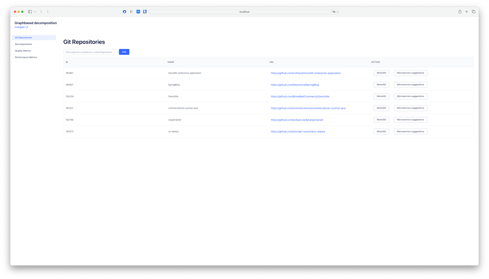
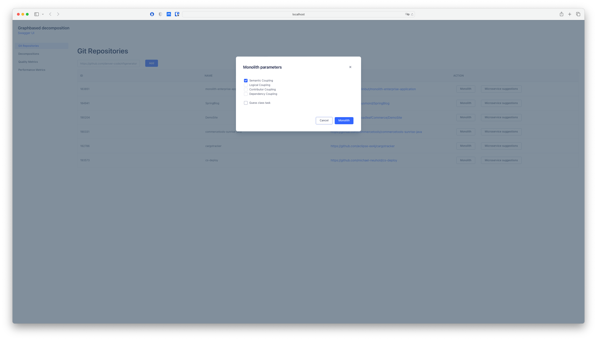
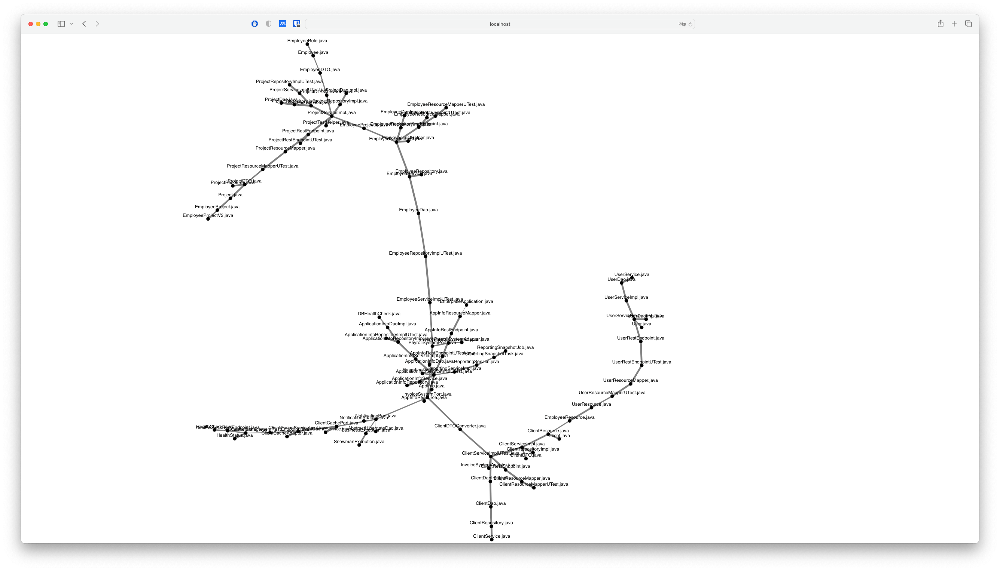
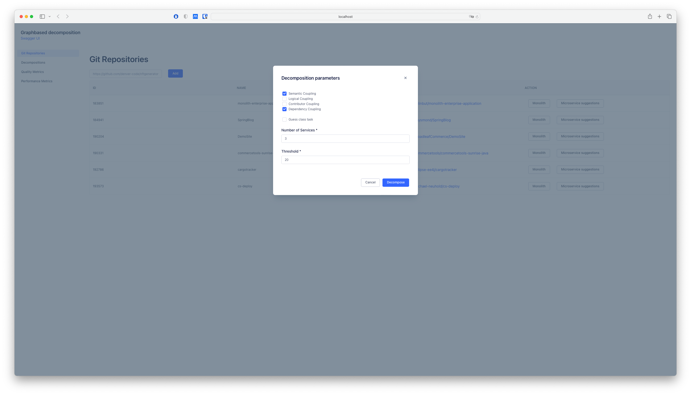
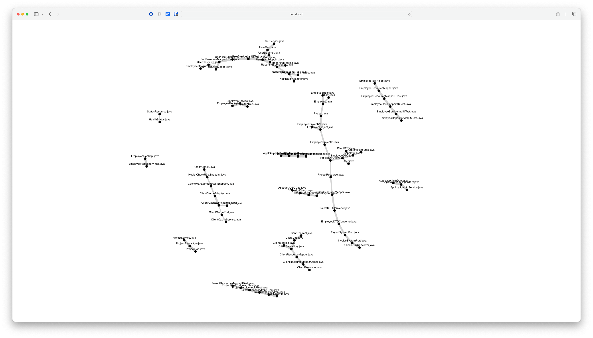
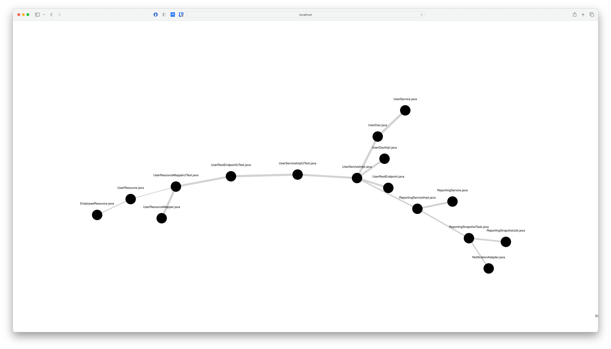
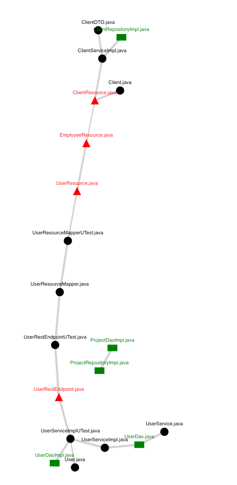
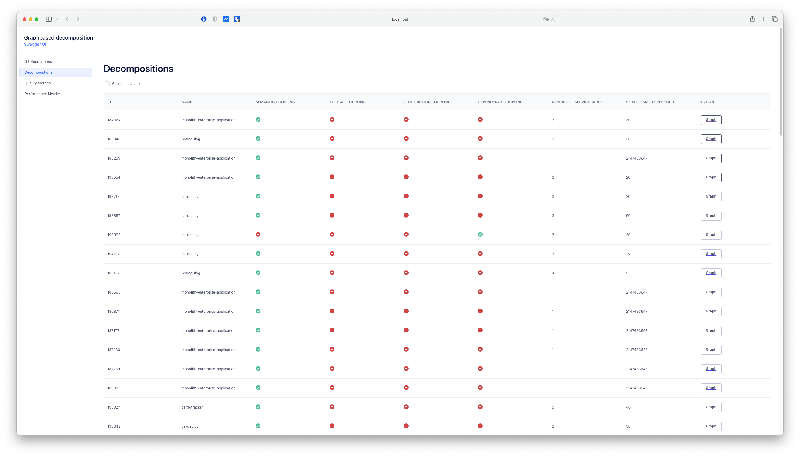
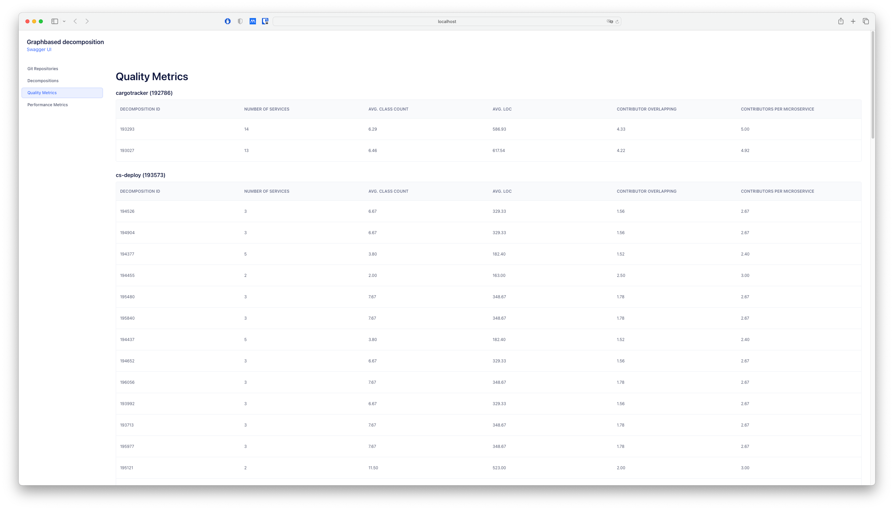
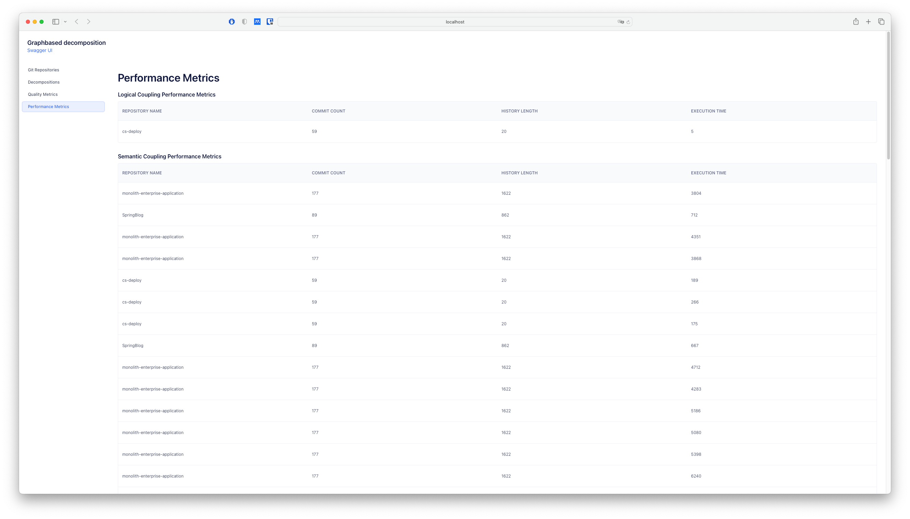

# Graph-based decomposition of monolithic architectures - a path to microservice architectures

## How to start
To start the frontend application a instance of the [backend](https://github.com/michael-neuhold/graphbased-decomposition-backend) needs to run. If this is the case, it is sufficient to
execute the command below. This will generate the API interfaces based on the `Swagger` documentation
and start the react app.
````
npm start
````

## Workflows

### Manage git repositories


### Visualize monolithic graph

#### Select coupling strategy to build graph weights


#### Monolithic graph


### Visualize microservice suggestions

#### Select coupling strategy as well as settings for decomposition


#### Microservice suggestions overview


#### Microservice suggestion detail


#### Microservice suggestion with class task guess


### Manage decompositions

### Analyze quality metrics


### Analyze performance metrics
